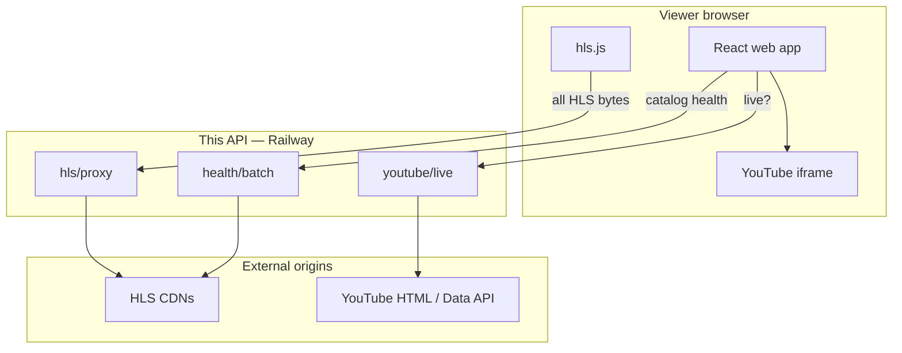
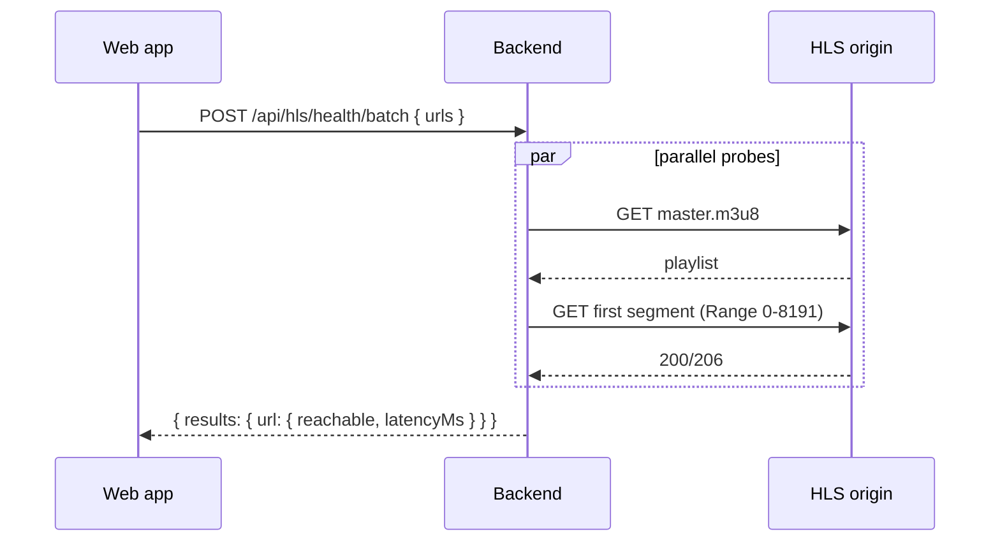
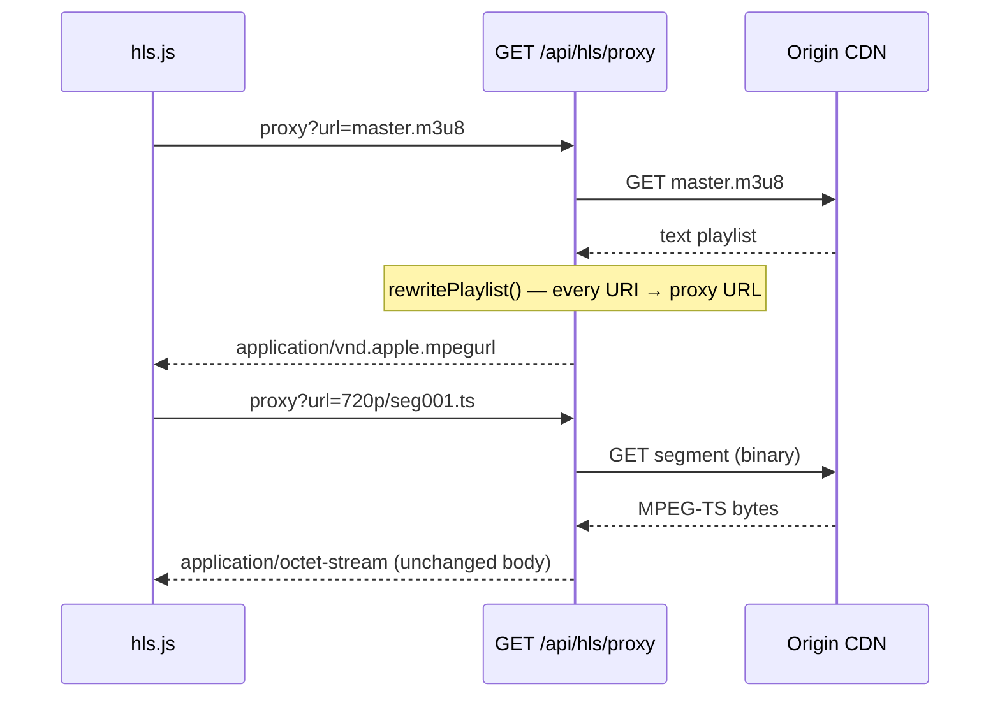

# Live Stream Aggregator Backend

Thin TypeScript API ([Hono](https://hono.dev/)) for the [Live Stream Aggregator web app](https://github.com/tejasvi-mehra/live-stream-aggregator). Provides **HLS proxying**, **server-side health probes**, and **YouTube live detection**.

This is a **personal-use** companion service — not a media ingest pipeline, transcoder, or CDN. It exists so a small browser app can play third-party HLS reliably without CORS issues and with pre-flight reachability checks.

**Live API:** https://live-stream-aggregator-backend-production.up.railway.app/

**Web app:** https://live-stream-aggregator.vercel.app/

**Web app repo:** https://github.com/tejasvi-mehra/live-stream-aggregator

---

## API surface

| Endpoint | Method | Purpose |
|----------|--------|---------|
| `/health` | GET | Service liveness |
| `/api/hls/health` | GET | Probe one HLS manifest (+ optional first segment) |
| `/api/hls/health/batch` | POST | Parallel probes for catalog startup `{ urls: string[] }` |
| `/api/hls/proxy` | GET | Proxy manifest or segment; rewrite m3u8 URIs |
| `/api/youtube/live` | GET | YouTube channel live check (`channelUrl`, optional `channelId`) |

### What it does NOT do

- No ffmpeg ingest, transcoding, or packaging
- No YouTube → HLS restream (YouTube stays iframe in the web app)
- No automatic stream URL discovery
- No guarantee upstream feeds are live, licensed, or high quality

---

## System design

### Role in the stack



The web app is a static SPA on Vercel. **All HLS bytes** flow browser → this API → origin CDN. The API never stores segments long-term; it forwards and rewrites playlists on the fly.

### Why HLS proxy instead of direct browser → CDN?

Public sports CDNs often omit `Access-Control-Allow-Origin` headers. Browsers block cross-origin fetches from hls.js. Proxying through your own API:

1. Makes manifest/segment requests **same-origin** from the player’s perspective (API host)
2. Rewrites nested playlist URLs, encryption key URIs (`#EXT-X-KEY`), and init segment maps (`#EXT-X-MAP`)
3. Centralizes **SSRF protection** (block private IPs, optional hostname allowlist)
4. Keeps **binary segments** intact (arrayBuffer passthrough — no `.text()` on TS)

### Health check flow



Each probe validates the response looks like HLS, optionally fetches the first ~8 KB of a media segment, and records round-trip latency from the **API region** (Railway US) — not the viewer’s location.

### HLS proxy / playback data path



**Manifests:** fetched as text, parsed line-by-line, relative URLs resolved against the upstream base, then emitted with `PUBLIC_API_BASE/api/hls/proxy?url=...`.

**Segments:** fetched as `arrayBuffer()`, returned with upstream `Content-Type`, `Content-Length`, and `Content-Range` when present.

### YouTube live detection

Playback is always YouTube’s iframe. This API only returns metadata:

```json
{ "isLive": true, "channelId": "UC…", "title": "…" }
```

Detection modes (`YOUTUBE_LIVE_METHOD`):

| Mode | Behavior |
|------|----------|
| Default / `scrape` | Fetch channel `/live` HTML, parse live indicators |
| `data_api` | YouTube Data API search (requires `YOUTUBE_DATA_API_KEY`) |
| `auto` | Data API when key set; scrape fallback on errors |

---

## Stream catalog (web app)

Stream lists live in the web app repo as YAML:

https://github.com/tejasvi-mehra/live-stream-aggregator/blob/main/config/streams.yaml

The web app fetches the raw file from GitHub at startup, then probes HLS `url` and `audio[].url` values in a **background batch** (once per full page load) and again **when the user opens an event**. Both flows call `POST /api/hls/health/batch`. See the [web app README — Stream catalog](https://github.com/tejasvi-mehra/live-stream-aggregator/blob/main/README.md#stream-catalog-streamsyaml) for the full schema.

This API does **not** host or validate YAML — it only probes and proxies URLs the client sends.

---

## Quick start

```bash
git clone https://github.com/tejasvi-mehra/live-stream-aggregator-backend.git
cd live-stream-aggregator-backend
cp .env.example .env
npm install
npm run dev
```

Default local port: **3002**

```bash
npm test
npm run build && npm start
```

Pair with the web app:

```bash
git clone https://github.com/tejasvi-mehra/live-stream-aggregator.git
cd live-stream-aggregator
cp .env.example .env
VITE_API_BASE=http://localhost:3002 npm run dev
```

Full web app setup: https://github.com/tejasvi-mehra/live-stream-aggregator/blob/main/README.md

---

## Environment

| Variable | Default (local) | Production example |
|----------|-----------------|-------------------|
| `PORT` | `3002` | Railway sets automatically |
| `CORS_ORIGIN` | Built-in regex defaults (see below) | Comma-separated regex patterns matching allowed `Origin` headers |
| `PUBLIC_API_BASE` | `http://localhost:3002` | `https://live-stream-aggregator-backend-production.up.railway.app` |
| `PROXY_ALLOWLIST` | _(empty = all public hosts)_ | Comma-separated CDN hostnames (include segment CDNs from rewritten playlists, e.g. `cs.liiift.io` for Red Bull) |
| `FETCH_TIMEOUT_MS` | `10000` | Upstream fetch timeout |
| `YOUTUBE_DATA_API_KEY` | _(empty)_ | Optional Google API key |
| `YOUTUBE_LIVE_METHOD` | `auto` | `scrape` \| `data_api` \| `auto` |

`PUBLIC_API_BASE` must match the URL clients use to reach this API — it is written into rewritten m3u8 lines.

When `CORS_ORIGIN` is unset, these regex patterns are used:

```
^http://localhost(:\d+)?$
^https://live-stream-aggregator\.vercel\.app$
^https://live-stream-aggregator-[a-z0-9-]+-tejasvimehras-projects\.vercel\.app$
```

They cover local dev (any port), production, and Vercel preview deployments. Override with a comma-separated list of your own patterns if needed.

---

## Security

- Only `http:` / `https:` targets accepted
- Localhost and private IPv4 ranges rejected on proxy targets (SSRF guard)
- Set `PROXY_ALLOWLIST` before public deployment to restrict upstream hostnames
- No authentication — intended for personal use behind Vercel + Railway, not multi-tenant production

**Production example** (from `.env.example` — update when the catalog adds new origins):

```
PROXY_ALLOWLIST=cs.liiift.io,devstreaming-cdn.apple.com,edge13.vedge.infomaniak.com,kanal75xto-llhls.akamaized.net,na.linear.zype.com,play.redbull.com,rthktv35-vos-live.akamaized.net,streams2.sofast.tv,streamtv.as3sport.online
```

Manifest URLs may point at `play.redbull.com` while segments are served from `cs.liiift.io` after playlist rewrite — both hostnames must be allowed.

---

## Project layout

```
live-stream-aggregator-backend/
├── src/
│   ├── index.ts
│   ├── config.ts
│   ├── routes/
│   │   ├── hls.ts
│   │   └── youtube.ts
│   └── lib/
│       ├── hlsProxy.ts         # fetch + rewrite or passthrough
│       ├── hlsHealth.ts        # manifest + segment probe
│       ├── playlistRewrite.ts  # m3u8 URI rewriting
│       ├── playlistParser.ts
│       ├── youtubeLive.ts
│       └── urlUtils.ts         # SSRF + fetch timeout
└── ...
```

---

## Limits (personal-scale scope)

- **Upstream quality unchanged** — offline or low-bitrate origins stay offline/low-bitrate
- **Geo restrictions** — probes and proxy run from Railway region; some origins block US IPs
- **YouTube scrape fragility** — HTML changes can cause false negatives
- **No horizontal scaling design** — single Node process; fine for one user, not a broadcast aggregator
- **Manual URL curation** — m3u8 URLs are pasted into YAML by hand

---

## Trade-offs

| Decision | Rationale |
|----------|-----------|
| **Thin proxy vs media server** | Minimal ops for personal viewing; no ffmpeg/OvenMediaEngine to run |
| **Playlist rewrite in Node** | Keeps hls.js simple; all relative URLs stay on proxy path |
| **Batch health** | Background catalog probe on page load + per-event probe on play; keeps UI responsive |
| **Binary segment passthrough** | Correct TS delivery; text decoding would corrupt segments |

---

## Possible improvements

- Stream proxy response bodies with `ReadableStream` (lower memory on large segments)
- Cache health results with short TTL
- Serve catalog YAML from this API (`GET /api/catalog`) with embedded health
- Geo-aware probe regions

---

## Costs

**$0** on default Railway/Vercel free tiers at personal traffic. Optional YouTube Data API within free quota.
