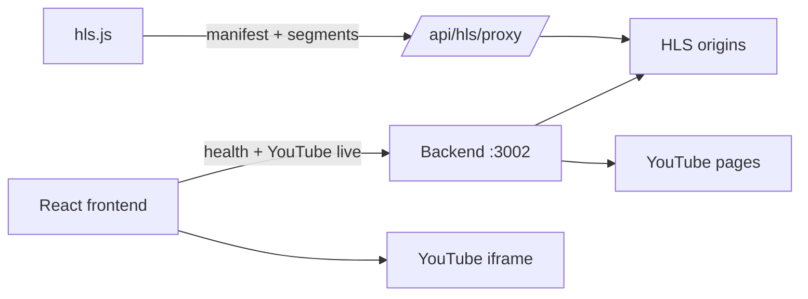

# Live Stream Aggregator Backend

Thin TypeScript API that supports the [Live Stream Aggregator frontend](../sports-streaming) with **HLS proxying**, **server-side health probes**, and **YouTube live detection**. It does not transcode, restream YouTube as HLS, or discover stream URLs.

## What this backend does

| Endpoint | Purpose |
|----------|---------|
| `GET /health` | Service liveness |
| `GET /api/hls/health?url=` | Server-side HLS manifest + first-segment probe |
| `POST /api/hls/health/batch` | Parallel probes for catalog startup |
| `GET /api/hls/proxy?url=` | Proxy manifests/segments; rewrite m3u8 URIs through this server |
| `GET /api/youtube/live` | YouTube channel live check — **HTML scrape by default**; optional **YouTube Data API** when `YOUTUBE_DATA_API_KEY` is set |

## What it does NOT do

- No ffmpeg ingest or transcoding
- No YouTube → HLS restream (YouTube playback stays iframe in the frontend)
- No automatic URL discovery or Buffstreams scraping
- No guarantee that upstream feeds are live or high quality

## Where it helps (assignment rubric)

| Rubric area | How this backend helps |
|-------------|------------------------|
| **Stream quality (40%)** | Same-origin HLS delivery avoids browser CORS failures; server probes catch dead manifests before playback; proxy rewrites keep hls.js segment loads reliable |
| **Architecture (20%)** | Clear browser → API → origin path; deployable service; removes Vite-only YouTube middleware |
| **Demo & polish (15%)** | Frontend static build + deployed API enables review without `npm run dev` only |
| **Problem-solving (25%)** | Pragmatic thin proxy instead of over-building media pipeline |

## Limits

- **Upstream quality is unchanged** — if the origin is offline, low bitrate, or not a real game feed, the proxy cannot fix it
- **Demo IPTV URLs** — production YAML may include public IPTV-style HLS endpoints to exercise the product; these are not private streams and are not guaranteed live
- **YouTube scrape is fragile** — markup changes can cause false negatives
- **Open proxy risk** — use `PROXY_ALLOWLIST` in production; localhost/private IPs are blocked by default
- **Manual YAML curation** — you still paste m3u8 URLs when you get them

## Architecture



**Playback paths**

- **HLS:** Browser loads `GET /api/hls/proxy?url=<origin>` → backend fetches upstream, rewrites playlist lines, streams segments
- **YouTube:** Backend only answers “is this channel live?”; frontend embeds `live_stream?channel=...`

## Quick start

```bash
cd live-stream-aggregator-backend
cp .env.example .env
npm install
npm run dev
```

Default port: **3002**

Run tests:

```bash
npm test
```

Run the frontend with the API base set:

```bash
cd ../sports-streaming
VITE_API_BASE=http://localhost:3002 npm run dev:production
```

`VITE_API_BASE` is required by the frontend — the app will not start without it.

## Environment

| Variable | Default | Description |
|----------|---------|-------------|
| `PORT` | `3002` | HTTP listen port |
| `CORS_ORIGIN` | `http://localhost:3001` | Allowed frontend origin |
| `PUBLIC_API_BASE` | `http://localhost:3002` | Base URL written into rewritten m3u8 lines |
| `PROXY_ALLOWLIST` | _(empty = all public hosts)_ | Comma-separated allowed hostnames |
| `FETCH_TIMEOUT_MS` | `10000` | Upstream fetch timeout |
| `YOUTUBE_DATA_API_KEY` | _(empty)_ | Optional Google API key for live detection |
| `YOUTUBE_LIVE_METHOD` | `auto` | `scrape` \| `data_api` \| `auto` (API when key set, else scrape; `auto` falls back to scrape on API errors) |

**YouTube playback is always iframe embed** — the Data API is used only for live detection, not video delivery.

## Security notes

- Only `http:` / `https:` targets are accepted
- Localhost and common private IPv4 ranges are rejected (SSRF guard)
- Set `PROXY_ALLOWLIST` before any public deployment
